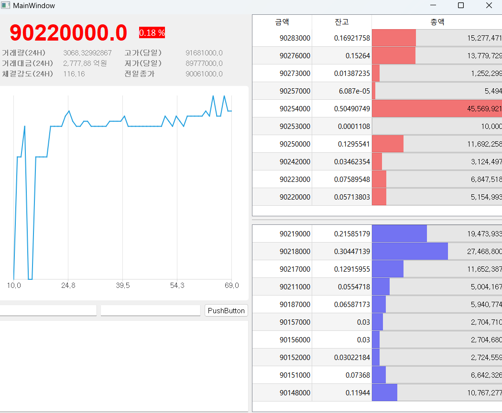

# Bitcoin Auto-Trading System with PyQt5 GUI

This project is an auto-trading system for Bitcoin that utilizes a PyQt5 graphical user interface (GUI) to provide a real-time view of the market, order book, and other relevant information.


---
## Features

- Automatic Bitcoin trading using Python
- Real-time chart to visualize market trends
- Order book to view buy and sell orders
- Overview panel for key market data


## Getting Started

1. Prerequisites
    - Python 3
    - PyQt5 library
    - Other libraries required for the trading functionality (not specified in the image)

2. Installation
    - Install the required libraries using pip:
```Bash
pip install PyQt5
pip install pyupbit
```

3. Run the application
    - Navigate to the project directory in your terminal.
    - Run the main script using Python:
```Bash
python main.py
```


## Explanation of the GUI

The GUI consists of three main components:

1. Real-time chart: This section displays a graph that visualizes the price of Bitcoin over time.
2. Order book: This section shows the current buy and sell orders for Bitcoin, including the price and quantity of each order.
3. Overview panel: This section provides key market data such as the current price, 24-hour trading volume, and high/low prices for the day.


## Further Development

This is a basic auto-trading system with a GUI. You can further develop it by adding features such as:

- More sophisticated trading strategies
- Backtesting capabilities
- Risk management tools


## Note:

- This is a basic example and may not be suitable for real-world trading. It's recommended to thoroughly test the system in a simulated environment before using it with real funds.
- Auto-trading involves financial risks. Use this project at your own discretion.

## Additional Information

- PyQt5: https://riverbankcomputing.com/software/pyqt/intro


I hope this helps! Let me know if you have any other questions.