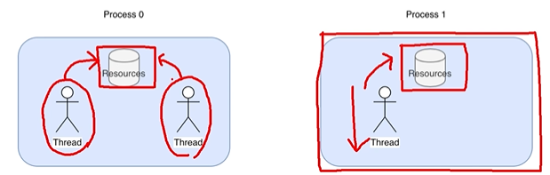
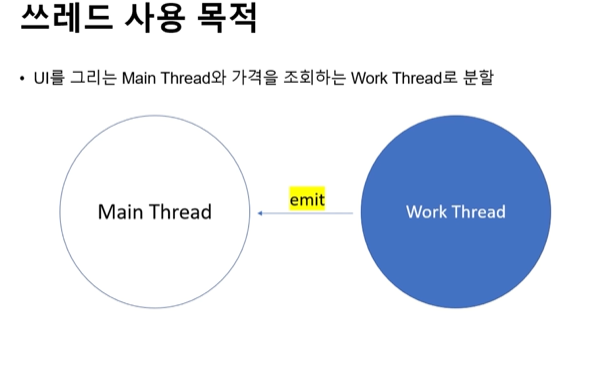

# 스레드(Thread)

## 스레드란?
- 프로세스의 실행 단위, 일꾼이라고 보면 됨
- 프로세스는 운영 체제로부터 독립된 자원 할당(한 프로세스가 다른 프로세스에 직접 접근 불가)

## 스레드 스케줄링
- 운영체제는 프로세스를 아주 짧은 시간마다 실행 -> 동시에 실행되는 것처럼 보임
- 스레드도 아주 짧은 시간마다 실행 반복(실행 시간은 중요도에 따라 다름)
- 그 우선 순위를 정하는 걸 스케줄링이라고 함

### Qtimer에서 문제점
Ui를 그리는 동시에 가격 조회를 할 수 없음(가격 조회 후 Ui 생성)
-> 가격 조회를 하는 시간이 상대적으로 길어 Ui가 뚝뚝 끊김

### 해결방안 : Qthread
Work Thread를 추가하여 네트워크, 파일 연산 도중 다른 작업을 가능하게 함