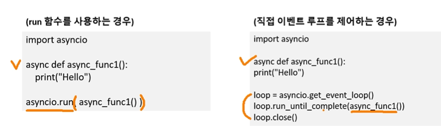

## REST api
- 웹주소를 api로 사용하는 기술


### 문제점
- 요청(request)-응답(response) 방식
- - 프로그래머가 특정 api 요청 -> 서버는 결과값 응답
- - 요청 횟수에 제한(ex. 10회/초)
- - 서버에서 바로 알 수 없음, 즉 지연이 발생

-------

## 웹소켓 방식
- 서버-클라이언트 실시간 양방향 통신 기술
- - 실시간 전송을 위해 암호화폐 거래소에서 사용함
- - 요청-응답이 아닌, 구독(subscribe) 방식
- - 서버에서 체결 즉시 구독한 클라이언트(PC)에 해당 데이터 전송


### 웹소켓 in python
- 비동기 처리를 위해 asyncio라는 파이썬 묘듈을 사용하여 구현
* * 동기(synchronous) 호출은 한 함수 호출이 끝난 후 다음 함수를 순차적으로 처리하는 방식
* * 비동기(asynchronous) 호출은 함수 호출이 끝나기 전에 다음 함수를 실행하며 처리하는 방식

- 데이터를 준비하는데 시간이 필요한 작업에서 비동기 호출이 유리
- 각 작업을 잘 처리하기 위한 스케줄러 필요

------

## 코루틴
- 파이썬에서 async 키워드가 붙어있는 함수를 의미
- 일반 함수와 달리 비동기적 처리가 가능
- 호출 방식이 기존 함수와 다름 (이벤트 루프가 있어야 함)

```Python
import time
def make_americano():
    print("Americano Start")
    time.sleep(3)
    print("Americano End")

def make_latte():
    print("Americano Start")
    time.sleep(5)
    print("Americano End")

print("Main Start") | Main Start
make_americano()    | Americano Start 3초 대기 End
make_latte()        | Latte Start 5초 대기 End
print("Main End")   | Main End
```
```Python
import asyncio
async def make_americano():
    print("Americano Start")
    await asyncio.sleep(3)
    print("Americano End")

async def make_latte():
    print("latte Start")
    await asyncio.sleep(5)
    print("latte End")

async def main():
    coro1 = make_americano()
    coro2 = make_latte()
    await asyncio.gather( # 동시에 실행
        coro1,
        coro2
    )
print("Main Start")
asyncio.run(main())
print("Main End")

| Main Start
| Americano Start
| Latte Start
| Americano End
| Latte End
| Main End
```